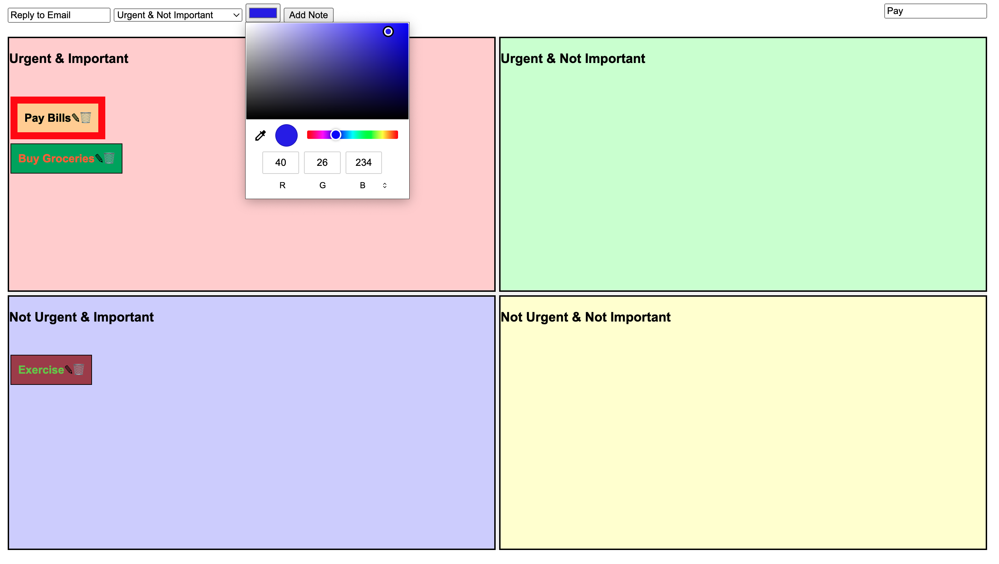
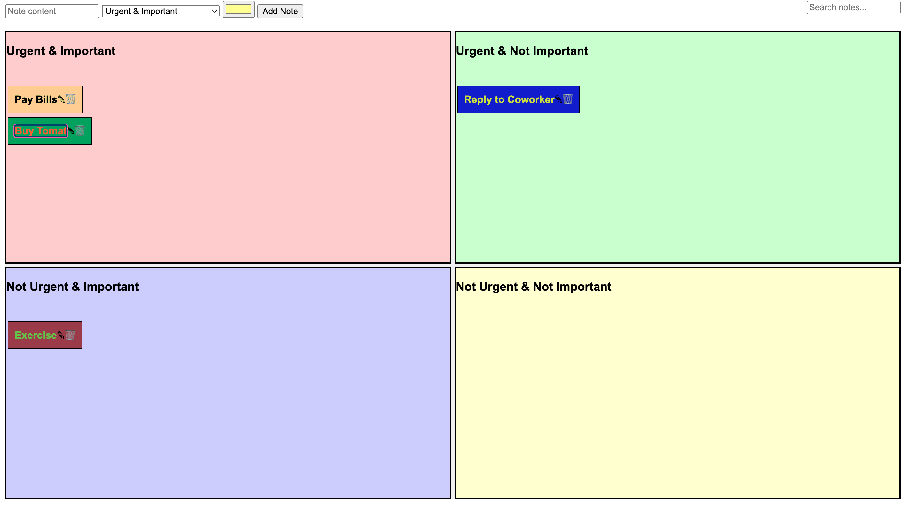
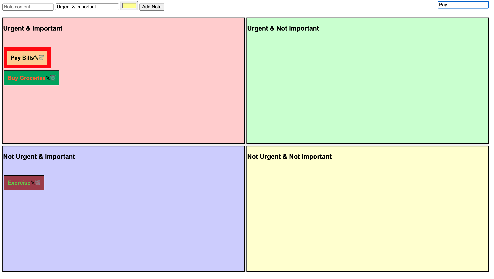

# TaskTracker

The Task Tracker App is a simple yet powerful tool designed to help users manage their tasks efficiently. Built with Flask, Javascript, Python, HTML, and CSS, this application offers a user-friendly interface and a set of features that cater to anyone looking to organize their tasks better.

## Main Features

* **Quadrant-Based Task Organization:** Tasks are divided into 4 quadrants based on their urgency and importance: Urgent & Important, Urgent & Not Important, Not Urgent & Important, and Not Urgent & Not Important. This method helps users prioritize their tasks effectively.


* **Create Notes:** Users can easily create notes for tasks and place them in any of the 4 quadrants, allowing for flexible task management.



* **Edit Notes:** Each note is editable, enabling users to update task details as needed.



* **Delete Notes:** Users have the option to delete tasks that are no longer relevant or have been completed.

* **Drag and Drop:** Tasks can be moved between quadrants through a simple drag-and-drop interface, making task re-prioritization effortless.

* **Search Notes:** A search bar allows users to quickly find specific tasks, with matching notes highlighted for easy identification.



* **Color Coding:**  Notes and quadrants support different colors, enhancing visual organization and making it easier to distinguish between tasks.

## Technologies & Frameworks User

* **Flask:** A micro web framework written in Python, used for handling backend logic, routing, and server-side operations.

* **JavaScript:** Utilized for creating dynamic content on the client side, including drag-and-drop functionality, search features, and real-time updates to the UI.

* **Python:** The core programming language used for server-side logic and interaction with the database.

* **HTML & CSS:** Used for structuring and styling the web application's interface, ensuring a responsive and intuitive design.

* **SQLite:** Used for backend Relational Database.

## Getting Started

* To run the Task Tracker App on your local machine, follow these steps:

1. **Clone the Repository:** Clone the project to your local machine.
```bash
git clone https://github.com/meet1993shah/TaskTracker.git
```

2. **Set Up a Virtual Environment:** Navigate to the project directory and set up a Python virtual environment.
```bash
cd TaskTracker
python3 -m venv venv
```

3. **Activate the Virtual Environment:**
	* On Windows: `venv\Scripts\activate`
	* On macOS/Linux: `source venv/bin/activate`

4. **Install Dependencies:** Install the required Python packages
```bash
pip3 install -r requirements.txt
```

5. **Run the Application:** Start the Flask application
```bash
flask run
```
OR
```bash
python3 app.py
```

6. **Access the App:** Open your web browser and navigate to `http:127.0.0.1:5000/` to start using the Task Tracker App.

## Contributing

Contributions to the Task Tracker App are welcome! Whether it's bug reports, feature requests, or code contributions, pleasefeel free to reach out or submit a pull request.
