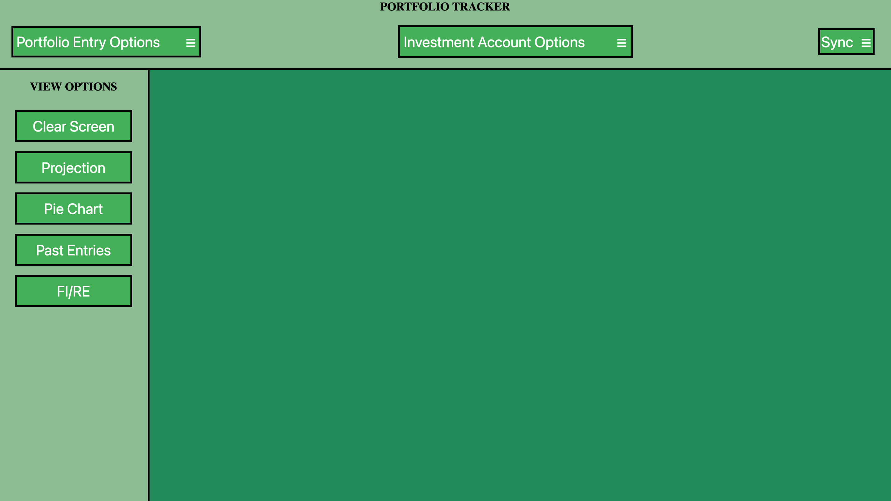

# Portfolio Tracker

The Portfolio Tracker App is a simple yet powerful application designed to help users keep track of their investment portfolio manually and displaying future projections. Built with Flask, Javascript, Python, HTML, and CSS, this application offers a user-friendly interface and a set of features that cater to anyone looking for an alternative to Excel Sheets for their investments.



## Main Features

* **Add New Accounts:** Users can easily create new account names


* **Update Account Name:** Users can easily update any existing account name


* **Delete Account:** Users can also delete account if needed, however this will fail if any existing entry is using the account name


* **Add New Portfolio Entry:** Users can easily add a new portfolio entry


* **Update Existing Entry:** Users can easily update any existing entry


* **Delete Existing Entry:** Users can also delete an entry if needed


* **Pie Chart:** Users can create pie chart for any past portfolio entry and view the distribution


* **Projection:** Users can view future projected growth based on the current entries


* **Display Past Entries:** Users can view the last 10 entries of the portfolio


* **FI/RE Calculator:**  Users can get an estimate for FI/RE


* **Import DB from GCP:** Users can import DB from GCP


* **Export DB to GCP:** Users can export DB to GCP


* **Android App:** Users can also create an Android APP if needed
	* The Android app will have all the features that the desktop App has

## Technologies & Frameworks User

* **Flask:** A micro web framework written in Python, used for handling backend logic, routing, and server-side operations.

* **JavaScript:** Utilized for creating dynamic content on the client side.

* **Python:** The core programming language used for server-side logic and interaction with the database.

* **HTML & CSS:** Used for structuring and styling the web application's interface, ensuring a responsive and intuitive design.

* **SQLite:** Used for backend Relational Database.

* **Buildozer:** Used for creating Android APP

## Getting Started

* To run the Portfolio Tracker App on your local machine, follow these steps:

1. **Clone the Repository:** Clone the project to your local machine.
```bash
git clone https://github.com/meet1993shah/PortfolioTracker.git
cd PortfolioTracker
```

2. **Install Dependencies:** Install the required Python packages
```bash
pip3 install -r requirements.txt
```

3. **GCP Integration:** Integrate with GCP for storing DB
	* Create a GCP account and create a service account
	* Once, you create a service account, Create the service account key
	* Store the service account key as gcp-secrets.json file

* **NOTE:** This is Only Needed if you need the DB Import/Export functionality

4. **Run the Application:** Start the Flask application
```bash
python3 main.py
```

5. **Access the App:** Open your web browser and navigate to `http://127.0.0.1:8080/` to start using the Portfolio Tracker App.

## Creating Android APP

* I'm assuming you've already performed the steps mentioned in Getting Started Section

1. **Install Buildozer:** Install Buildozer
```bash
pip3 install --user --upgrade buildozer
```

2. **Connect Android Device:** Connect your android device to the local machine, you can check if the device is connected or not by the following bash commands
```bash
adb devices
# If the service needs to start
adb start-server
adb --help
```

3. **Update Buildozer Spec:** If needed you can change the spec info in buildozer.spec file

4. **Run Buildozer:** Run Buildozer
```bash
buildozer -v android debug deploy run logcat > app_log.txt
```
* this will take a long time to build on the first run, on successful completion you'll find the apk file in bin/ folder
* this will also create a app_log.txt file for debugging and logging
* the apk will automatically be installed on your Android Device on success

## Contributing

Contributions to the Portfolio Tracker App are welcome! Whether it's bug reports, feature requests, or code contributions, please feel free to reach out or submit a pull request.
